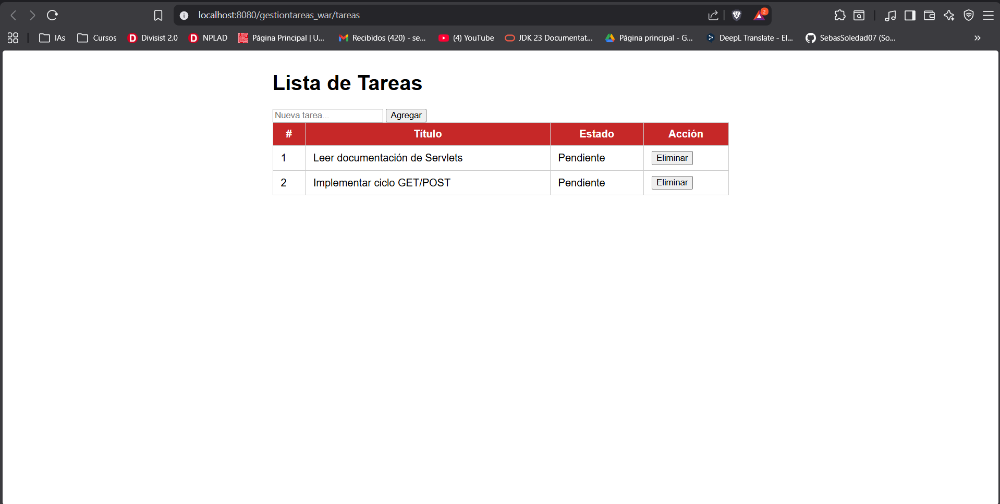

# gestion-tareas Sebastian Soledad - 1152172
Pequeña aplicación web de ejemplo (WAR) que gestiona una lista de tareas en memoria.

## Resumen rápido
- Java 17
- Empaquetado: WAR (artifactId: gestiontareas)
- Servlets (Jakarta Servlet API 6.0) + JSP con JSTL

## Requisitos
- JDK 17
- Maven 3.x
- Servidor compatible Jakarta EE 10 (ej. Apache Tomcat 10.1+)

## Construir y generar WAR
```powershell
mvn clean package
# Salida: target/gestiontareas.war
```
## Puntos importantes del proyecto
- Controlador principal: `src/main/java/com/ejemplo/servlet/TareasServlet.java` (mapeado en `@WebServlet("/tareas")`).
- Modelo: `src/main/java/com/ejemplo/model/Tarea.java`.
- Vista: `src/main/webapp/views/tareas.jsp` (JSTL).
- `index.jsp` redirige a `/tareas`.
- Descriptor de despliegue: `src/main/webapp/WEB-INF/web.xml` (Jakarta 6.0).

## Convenciones y comportamiento
- POST usa un parámetro `accion` (valores actuales: `agregar`, `eliminar`).
- Patrón PRG: después de un POST el servlet hace `resp.sendRedirect(...)`.
- El servlet mantiene `private final List<Tarea> tareas = new ArrayList<>();` como estado en memoria (no persistente, no sincronizado).
- `doPost` llama a `req.setCharacterEncoding("UTF-8")` antes de leer parámetros.

## Operaciones rápidas para desarrolladores / agentes
- Añadir nueva acción POST: modificar `TareasServlet#doPost` y actualizar `tareas.jsp` para enviar `accion` adecuado.
- Sincronización rápida: envolver mutaciones sobre `tareas` en `synchronized (tareas) { ... }` o sustituir por `Collections.synchronizedList(...)`.
- Persistencia: reemplazar `List<Tarea>` por un DAO y actualizar puntos donde se crean/eliminan tareas (init, doPost).


### Captura de pantalla

¿Qué probar después de clonar?
```powershell
cd C:\ruta\a\gestiontareas
mvn clean package
# Desplegar target/gestiontareas.war en Tomcat 10.1+
```

